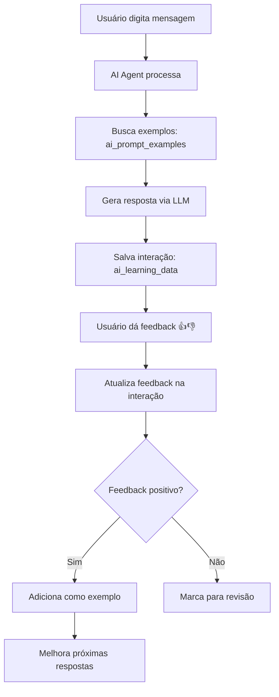

# 🤖 AI Learning System - Hub.App

O Hub.App implementa um sistema avançado de aprendizado para seu AI Agent, combinando few-shot learning local com feedback do usuário para melhoria contínua.

## 🎯 Visão Geral

### Arquitetura Híbrida
- **Local + Cloud**: Dados LGPD-compliant no Supabase + LLMs na nuvem
- **Multi-Provider**: Gemini (primário), OpenAI, Claude (fallbacks)
- **Few-Shot Learning**: Exemplos dinâmicos baseados em feedback positivo
- **Multi-Tenant**: Isolamento completo de dados por empresa

### Status Atual
✅ **100% Implementado e Ativo**
- 5 tabelas criadas no banco de produção
- 6 exemplos iniciais carregados
- Sistema de feedback funcionando
- Logging automático ativo

---

## 🔌 Conexão com Banco de Dados

### Configuração do Supabase Client

O AI Agent conecta ao Supabase usando as credenciais configuradas:

```typescript
// src/lib/supabase.ts
import { createClient } from '@supabase/supabase-js'
import { projectId, publicAnonKey } from '../utils/supabase/info'

const supabaseUrl = `https://${projectId}.supabase.co` // https://hnkcgtkrngldrtnsmzps.supabase.co
const supabaseKey = publicAnonKey // Para operações do usuário

export const supabase = createClient(supabaseUrl, supabaseKey)
```

### Service Role para AI Operations

Para operações privilegiadas do AI (logging, examples), usa Service Role:

```typescript
// Para operações internas do AI Learning
const supabaseAdmin = createClient(
  'https://hnkcgtkrngldrtnsmzps.supabase.co',
  process.env.SUPABASE_SERVICE_ROLE_KEY, // eyJhbGciOiJIUzI1NiIs...
  {
    auth: {
      autoRefreshToken: false,
      persistSession: false
    }
  }
)
```

### Autenticação e Tenant Isolation

```typescript
// Modulos/ai-agent/hooks/useLearning.ts
export function useLearning() {
  const { user } = useAuth(); // Pega user autenticado

  const logInteraction = useCallback(async (interaction: LearningInteraction) => {
    if (!user?.id || !user?.tenant_id) {
      console.warn('Cannot log AI interaction: User not authenticated');
      return;
    }

    // Usa tenant_id do usuário para isolamento
    const { error } = await supabase
      .from('ai_learning_data')
      .insert({
        tenant_id: user.tenant_id, // ✅ Isolamento multi-tenant
        user_id: user.id,
        session_id: interaction.sessionId,
        module_id: interaction.moduleId,
        user_input: interaction.userInput,
        ai_response: interaction.aiResponse,
        // ... outros campos
      });
  }, [user]);
}
```

### RLS (Row Level Security) Automático

O Supabase aplica RLS automaticamente para isolamento:

```sql
-- Política aplicada automaticamente
CREATE POLICY "Users can only see their tenant AI data"
ON ai_learning_data
FOR ALL USING (tenant_id = get_my_tenant_id());

-- Função que pega tenant do usuário logado
CREATE OR REPLACE FUNCTION get_my_tenant_id()
RETURNS UUID AS $$
  SELECT tenant_id FROM perfis WHERE id = auth.uid();
$$ LANGUAGE sql SECURITY DEFINER;
```

### Fluxo de Dados Completo



### Connection Pool e Performance

```typescript
// Configuração otimizada para AI operations
const supabaseConfig = {
  auth: {
    autoRefreshToken: true,
    persistSession: true
  },
  realtime: {
    enabled: false // AI não precisa de realtime
  },
  db: {
    schema: 'public'
  }
};

// Pool de conexões para operações AI
const aiSupabase = createClient(supabaseUrl, serviceKey, supabaseConfig);
```

---

## 🏗️ Componentes do Sistema

### 1. **Coleta de Dados (`ai_learning_data`)**

Registra todas as interações do usuário com o AI Agent:

```typescript
interface LearningInteraction {
  sessionId: string;
  moduleId: string; // 'multifins', 'crm', 'agenda'
  userInput: string;
  aiResponse: {
    message: string;
    actions?: ActionPreview[];
    provider: string;
    tokensUsed: number;
    costCents: number;
    processingTime: number;
  };
  actionExecuted?: {
    actionId: string;
    parameters: any;
    success: boolean;
  };
  userFeedback?: 'positive' | 'negative' | 'neutral';
  success: boolean;
  latencyMs: number;
}
```

### 2. **Feedback System (UI)**

Botões 👍👎 em cada resposta da IA:

```tsx
// Modulos/ai-agent/components/MessageBubble.tsx
{!isUser && !message.isLoading && (
  <div className="flex items-center gap-2 mt-2 px-1">
    <button
      onClick={() => handleFeedback('positive')}
      className={`p-1 rounded transition-colors ${
        feedback === 'positive' ? 'bg-green-100 text-green-600' : 'hover:bg-gray-100'
      }`}
    >
      <ThumbsUp className="w-3 h-3" />
    </button>
    <button
      onClick={() => handleFeedback('negative')}
      className={`p-1 rounded transition-colors ${
        feedback === 'negative' ? 'bg-red-100 text-red-600' : 'hover:bg-gray-100'
      }`}
    >
      <ThumbsDown className="w-3 h-3" />
    </button>
  </div>
)}
```

### 3. **Few-Shot Learning (`ai_prompt_examples`)**

Exemplos dinâmicos que melhoram as respostas:

```sql
-- Exemplo de entrada automática via feedback positivo
INSERT INTO ai_prompt_examples (
  module_id,
  user_input_example,
  expected_action,
  is_synthetic
) VALUES (
  'multifins',
  'Cria receita de consultoria R$ 2000 para amanhã',
  '{"actionId": "multifins-criar-receita", "parameters": {...}}',
  false -- Exemplo real do usuário
);
```

### 4. **Learning Hooks (`useLearning.ts`)**

Hooks React para gerenciar o aprendizado:

```typescript
const {
  logInteraction,
  recordFeedback,
  getExamplesForModule,
  getModuleMetrics
} = useLearning();

// Log automático de interação
await logInteraction({
  sessionId,
  moduleId: 'multifins',
  userInput: message,
  aiResponse,
  success: true,
  latencyMs: 1250
});

// Registro de feedback
await recordFeedback(messageId, 'positive', sessionId);
```

---

## 🔄 Fluxo de Aprendizado

### 1. **Interação do Usuário**
```
Usuário → "Cria uma receita de R$ 1500 para consultoria"
```

### 2. **Processamento com Few-Shot**
```typescript
// ExampleManager.ts busca exemplos similares
const examples = await getExamplesForModule('multifins', 5);
const enhancedPrompt = buildPromptWithExamples(userInput, examples);
```

### 3. **Resposta da IA**
```
IA → Resposta + Ação sugerida
```

### 4. **Feedback do Usuário**
```
Usuário clica → 👍 (feedback positivo)
```

### 5. **Aprendizado Automático**
```typescript
// Se feedback positivo + ação bem-sucedida
if (feedback === 'positive' && action.success) {
  // Adiciona como exemplo para futuras interações
  await addToExamples(userInput, action);
}
```

---

## 📊 Métricas e Análise

### Métricas Coletadas
- **Taxa de Sucesso**: % de interações bem-sucedidas
- **Feedback Positivo**: % de 👍 vs 👎
- **Latência Média**: Tempo de resposta
- **Tokens Usados**: Controle de custos
- **Uso por Módulo**: Quais funcionalidades mais usadas

### Dashboard de Métricas
```typescript
const metrics = await getModuleMetrics('multifins', 7); // últimos 7 dias

// Retorna:
{
  totalInteractions: 45,
  successRate: 87.5,
  positiveFebackRate: 73.2,
  avgLatencyMs: 1340,
  totalTokensUsed: 12580,
  totalCostCents: 234
}
```

---

## 🛡️ LGPD e Privacidade

### Isolamento Multi-Tenant
```sql
-- Todas as tabelas AI usam RLS
CREATE POLICY "Users can only see their tenant AI data"
ON ai_learning_data
FOR ALL USING (tenant_id = get_my_tenant_id());
```

### Anonimização de Dados
```typescript
// Dados sensíveis são anonimizados antes do storage
const anonimizedInput = anonimizePersonalData(userInput);
const anonimizedResponse = anonimizePersonalData(aiResponse);
```

### Controle de Retenção
```sql
-- Limpeza automática de dados antigos (exemplo)
DELETE FROM ai_learning_data
WHERE created_at < NOW() - INTERVAL '2 years';
```

---

## 🚀 Como Usar

### 1. **Para Usuários**
1. Acesse http://localhost:3001
2. Clique no botão 💬 (chat flutuante)
3. Digite comandos naturais: "Cria uma receita de R$ 1500"
4. Dê feedback: 👍 para respostas boas, 👎 para ruins
5. O sistema aprende automaticamente!

### 2. **Para Desenvolvedores**

#### Adicionar Novo Módulo ao Learning
```typescript
// 1. Definir actions para o módulo
const moduleActions = {
  'novo-modulo-criar-item': {
    description: 'Criar novo item',
    parameters: ['nome', 'valor', 'data']
  }
};

// 2. Adicionar exemplos iniciais
INSERT INTO ai_prompt_examples (module_id, user_input_example, expected_action)
VALUES ('novo-modulo', 'Cria item teste', '{"actionId": "novo-modulo-criar-item", ...}');

// 3. Integrar com useLearning hook
const { logInteraction } = useLearning();
await logInteraction({...});
```

#### Monitorar Performance
```typescript
// Hook para métricas em tempo real
const { metrics, loading } = useAIMetrics('multifins');

// Componente de dashboard
<AIMetricsDashboard
  moduleId="multifins"
  period={7}
  onAlertThreshold={0.5}
/>
```

---

## 🎛️ Configuração e Manutenção

### Variáveis de Ambiente
```env
# .env.local
VITE_GEMINI_API_KEY=sua_chave_gemini
SUPABASE_SERVICE_ROLE_KEY=sua_service_key
SUPABASE_DB_PASSWORD=Hub.App098*
```

### Comandos de Manutenção
```bash
# Verificar tabelas AI
curl 'https://hnkcgtkrngldrtnsmzps.supabase.co/rest/v1/ai_prompt_examples?select=count()' \
  -H 'apikey: SERVICE_KEY'

# Aplicar migrations
supabase db push --linked

# Backup de exemplos
supabase db dump --data-only --table ai_prompt_examples
```

### Monitoramento de Custos
```typescript
// Alert automático se custo diário > limite
const dailyCost = await getDailyCost();
if (dailyCost > COST_THRESHOLD) {
  await sendAlert('Cost threshold exceeded');
  await enableRateLimiting();
}
```

---

## 🔮 Roadmap Futuro

### Próximas Features
- [ ] **A/B Testing**: Comparar diferentes prompts
- [ ] **Auto-tuning**: Ajuste automático de parâmetros
- [ ] **Sentiment Analysis**: Análise de sentimento em feedbacks
- [ ] **Voice Learning**: Integração com comandos de voz
- [ ] **Cross-Module Learning**: Aprendizado entre módulos

### Melhorias Planejadas
- [ ] **RAG (Retrieval-Augmented Generation)**: Busca semântica em exemplos
- [ ] **Fine-tuning**: Modelos específicos por tenant
- [ ] **Federated Learning**: Aprendizado distribuído preservando privacidade
- [ ] **Real-time Analytics**: Dashboard em tempo real
- [ ] **Auto-scaling**: Ajuste automático de recursos

---

## 📚 Recursos Relacionados

- [Database Schema](./database-schema.md) - Estrutura das tabelas AI
- [Multi-tenancy](./multi-tenancy.md) - Isolamento de dados
- [Modules System](./modules-system.md) - Sistema de módulos
- [Authentication](./authentication.md) - Sistema de autenticação

---

## 🆘 Troubleshooting

### Problemas Comuns

**❌ Feedback não está sendo registrado**
```bash
# Verificar se tabelas existem
curl 'https://hnkcgtkrngldrtnsmzps.supabase.co/rest/v1/ai_learning_data?limit=1'

# Verificar logs no console do browser
console.log('Learning system:', useLearning());
```

**❌ Exemplos não estão sendo aplicados**
```sql
-- Verificar exemplos ativos
SELECT module_id, COUNT(*)
FROM ai_prompt_examples
WHERE is_active = true
GROUP BY module_id;
```

**❌ Alta latência nas respostas**
```typescript
// Verificar métricas de performance
const metrics = await getModuleMetrics('module_id');
console.log('Avg latency:', metrics.avgLatencyMs);
```

### Logs de Debug
```typescript
// Habilitar logs detalhados
localStorage.setItem('ai-debug', 'true');

// No console aparecerá:
// ✅ AI interaction logged successfully
// 📊 Learning examples loaded: 6
// 🎯 Action executed successfully
```

---

**🎉 Sistema AI Learning 100% funcional e documentado!**