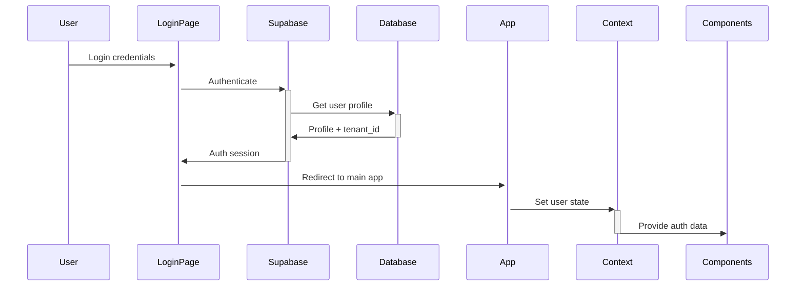

# 🏗️ Arquitetura do Sistema - Hub.App

O Hub.App foi projetado como uma **plataforma SaaS multi-tenant** com arquitetura moderna e escalável.

## 🎯 Visão Geral

### Princípios Arquiteturais
- **Multi-tenant**: Isolamento completo de dados por empresa
- **Mobile-First**: Interface otimizada para dispositivos móveis
- **Modular**: Sistema de módulos dinâmicos e extensíveis
- **Segurança**: Row Level Security (RLS) e autenticação JWT
- **Performance**: Lazy loading e otimizações de bundle

## 🏢 Arquitetura Multi-Tenant

### Como Funciona
```
Usuário → Autenticação → Tenant ID → Dados Isolados
```

1. **Usuário faz login** → Supabase Auth
2. **Sistema obtém perfil** → Tabela `perfis` 
3. **Extrai tenant_id** → Identificador da empresa
4. **Todas as queries** → Filtradas por tenant_id via RLS

### Benefícios
- **Isolamento total** entre empresas
- **Escalabilidade** horizontal
- **Segurança** por design
- **Simplicidade** no código da aplicação

## 🎨 Stack Tecnológico

### Frontend
```
React 18 + TypeScript + Vite
├── UI Framework: Radix UI
├── Styling: Tailwind CSS  
├── Animations: Framer Motion
├── Icons: Lucide React
└── State: Context API + Custom Hooks
```

### Backend
```
Supabase (Backend-as-a-Service)
├── Database: PostgreSQL 
├── Auth: Supabase Auth
├── Real-time: WebSockets
├── Storage: Supabase Storage
└── Security: Row Level Security (RLS)
```

## 📱 Arquitetura Responsiva

### Mobile-First Approach
```
Mobile (< 768px)
├── Grid Layout 4x4
├── Full-screen Background  
├── Touch-optimized UI
└── Drawer Navigation

Desktop (≥ 768px)  
├── Sidebar + Main Area
├── Hover Interactions
├── Keyboard Navigation
└── Multi-panel Layout
```

### Component Adaptation
```typescript
// Padrão usado nos componentes
const [isMobile, setIsMobile] = useState(false);

useEffect(() => {
  const checkIsMobile = () => {
    setIsMobile(window.innerWidth < 768);
  };
  checkIsMobile();
  window.addEventListener('resize', checkIsMobile);
}, []);
```

## 🧩 Sistema Modular

### Arquitetura de Módulos
```
Core System (Hub)
├── Authentication
├── Multi-tenancy  
├── Permissions
└── UI Framework

Dynamic Modules
├── CRM
├── Calendar/Agenda
├── Financeiro
├── Super Admin
└── Custom Modules
```

### Fluxo de Módulos
```
1. Módulos → Registrados na tabela `modulos`
2. Permissões → Verificadas via `user_permissions`
3. UI → Componentes carregados dinamicamente
4. Estado → Isolado por tenant_id
```

## 🔄 Fluxo de Dados

### Provider Hierarchy
```typescript
App
└── AuthProvider
    └── PermissionsProvider  
        └── ModulesProvider
            └── NotificationsProvider
                └── SettingsProvider
                    └── AppContent
```

### State Management Pattern
```typescript
// Custom Hooks Pattern
const { user, tenant, isAuthenticated } = useAuth();
const { modules, isLoading } = useModules(); 
const { hasPermission } = usePermissions();
const { background, logo } = useSettings();
const { unreadCount } = useNotifications();
```

## 🔐 Segurança

### Row Level Security (RLS)
```sql
-- Exemplo de política RLS
CREATE POLICY "Users can only see their tenant data" ON modulos
  FOR ALL USING (
    tenant_id = get_my_tenant_id()
  );
```

### Camadas de Segurança
1. **Supabase Auth** → Autenticação JWT
2. **RLS Policies** → Isolamento de dados
3. **Permission System** → Controle granular
4. **Frontend Guards** → Validação de acesso

## 📊 Fluxo de Autenticação



## 🎯 Padrões de Design

### Component Structure
```
src/
├── components/
│   ├── ui/           # Design System (Radix UI)
│   ├── settings/     # Settings pages
│   └── *.tsx         # Feature components
├── hooks/            # Custom hooks for state
├── lib/              # Utilities and configs
└── utils/            # Helper functions
```

### Naming Conventions
- **Components**: PascalCase (`AnimatedAppGrid`)
- **Hooks**: camelCase com "use" (`useAuth`)
- **Files**: kebab-case (`background-settings.tsx`)
- **Props**: camelCase (`isLoading`, `onSettingsOpen`)

## ⚡ Performance

### Otimizações Implementadas
- **Lazy Loading**: Módulos carregados sob demanda
- **Code Splitting**: Bundle otimizado por rota
- **Memoization**: React.memo em componentes pesados
- **Virtualization**: Listas longas otimizadas

### Bundle Analysis
```bash
npm run build
# Analise o tamanho dos chunks gerados
```

## 🔮 Escalabilidade

### Horizontal Scaling
- **Multi-tenant** → Um banco, múltiplas empresas
- **Módulos dinâmicos** → Funcionalidades sob demanda
- **CDN-ready** → Assets otimizados para CDN
- **API-first** → Backend independente do frontend

### Vertical Scaling
- **Caching** → Redis/CDN para performance
- **Database** → PostgreSQL scaling via Supabase
- **File Storage** → Supabase Storage ou S3
- **Monitoring** → Logs e métricas centralizadas

---

## 📚 Próximos Passos

- 🔐 Entenda [Multi-tenancy](./multi-tenancy.md) em detalhes
- 🧩 Explore [Sistema de Módulos](./modules-system.md)
- 💾 Configure [Base de Dados](./database-schema.md)
- 🎨 Revise [Design System](./design-system.md)