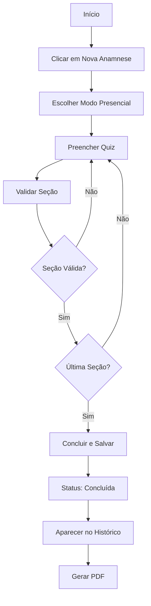
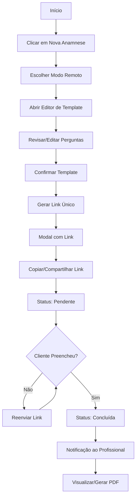
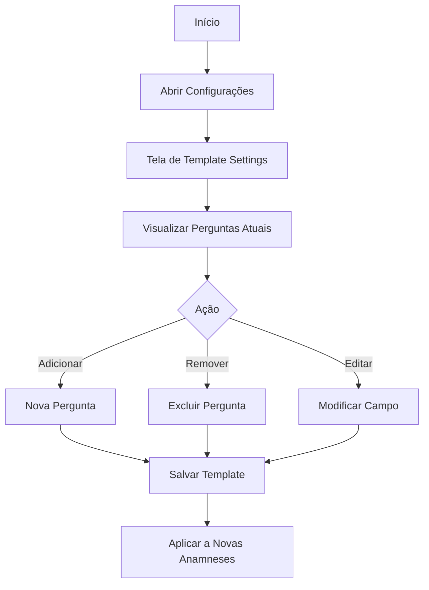

# Anamnese Pro - Documentação Completa

Sistema de anamnese digital para tatuadores e profissionais de estética.

---

## 📋 Índice

- [Visão Geral](#visão-geral)
- [Funcionalidades](#funcionalidades)
- [Arquitetura](#arquitetura)
- [Componentes](#componentes)
- [Fluxos de Uso](#fluxos-de-uso)
- [Limitações do Plano](#limitações-do-plano)
- [API e Integrações](#api-e-integrações)

---

## 🎯 Visão Geral

O **Anamnese Pro** é um módulo especializado para profissionais da área de tatuagem e estética realizarem anamneses digitais de forma eficiente.

### Público-Alvo

- Tatuadores
- Esteticistas
- Micropigmentadores
- Studios de tatuagem
- Clínicas de estética

### Problema que Resolve

- ✅ Elimina papelada física
- ✅ Centraliza histórico de clientes
- ✅ Permite preenchimento remoto
- ✅ Gera PDFs profissionais
- ✅ Organiza informações de saúde

---

## ⚡ Funcionalidades

### VERSÃO 1.0 (Atual)

#### ✅ Anamnese Presencial
- Profissional preenche durante o atendimento
- Quiz interativo com múltiplas seções
- Validação de campos obrigatórios
- Salvamento automático

#### ✅ Anamnese Remota
- Geração de link único
- Cliente preenche no próprio celular
- Notificação de conclusão
- Status de pendente/concluído

#### ✅ Editor de Template
- Customizar perguntas antes do envio
- Adicionar/remover campos
- Tornar campos obrigatórios/opcionais
- Preview em tempo real

#### ✅ Configurações de Template Padrão
- Template global para todas anamneses
- Organização por seções
- Drag & drop para reordenar (visual)
- Diferentes tipos de campo (texto, textarea, select, radio)

#### ✅ Geração de PDF
- PDF profissional com logo
- Layout organizado por seções
- Download automático
- Pronto para impressão

#### ✅ Histórico de Anamneses
- Listagem de todas anamneses
- Filtro por cliente
- Status visual (concluída/pendente)
- Detalhamento completo

#### ✅ Limite de Clientes
- Máximo 100 clientes no plano Pro
- Indicador visual de uso
- Alerta ao atingir 90%
- Upgrade para CRM ilimitado

### 🚧 Funcionalidades Futuras (Roadmap)

- Sistema de busca avançada
- Filtros por data, status, profissional
- Notificações push
- Integração com WhatsApp
- Assinatura digital
- Fotos anexadas
- Histórico de alterações
- Exportação em lote
- Relatórios estatísticos
- Multi-profissional (equipes)

---

## 🏗️ Arquitetura

### Estrutura de Pastas

```
anamnese-pro/
├── src/
│   ├── components/
│   │   ├── ui/                          # Componentes base (shadcn/ui)
│   │   ├── quiz/                        # Sistema de quiz
│   │   │   ├── QuizContainer.tsx        # Container principal
│   │   │   ├── QuizProgress.tsx         # Barra de progresso
│   │   │   └── QuizQuestion.tsx         # Pergunta individual
│   │   ├── anamnese/                    # Componentes específicos
│   │   │   ├── AnamneseDetails.tsx      # Modal de detalhes
│   │   │   ├── TemplateEditor.tsx       # Editor de template
│   │   │   └── LinkGenerated.tsx        # Modal de link gerado
│   │   ├── settings/                    # Configurações
│   │   │   └── TemplateSettings.tsx     # Config template padrão
│   │   ├── SearchModal.tsx              # Modal de busca (v1.1)
│   │   └── NotificationPanel.tsx        # Painel notificações (v1.1)
│   ├── utils/
│   │   └── generatePDF.ts               # Geração de PDF
│   ├── design-system.tsx                # Design System E4CEO
│   ├── App.tsx                          # Componente principal
│   └── main.tsx                         # Entry point
├── package.json
├── vite.config.ts
└── README.md
```

### Tecnologias

```json
{
  "dependencies": {
    "react": "^18.3.1",
    "react-dom": "^18.3.1",
    "lucide-react": "^0.344.0",
    "@radix-ui/react-*": "últimas versões",
    "jspdf": "^2.5.2",
    "jspdf-autotable": "^3.8.4",
    "tailwindcss": "^3.4.1"
  }
}
```

### Stack Técnico

- **Frontend**: React 18 + TypeScript
- **Build**: Vite 6 + SWC (compilação rápida)
- **Styling**: Tailwind CSS
- **UI Components**: Radix UI + shadcn/ui
- **Icons**: Lucide React
- **PDF**: jsPDF + jspdf-autotable
- **Forms**: React Hooks (useState, useEffect)

---

## 🧩 Componentes

### App.tsx

Componente principal da aplicação.

#### Estado Principal

```typescript
const [activeTab, setActiveTab] = useState('anamnese')
const [sidebarCollapsed, setSidebarCollapsed] = useState(false)
const [showQuiz, setShowQuiz] = useState(false)
const [showModeSelection, setShowModeSelection] = useState(false)
const [quizMode, setQuizMode] = useState<'presencial' | 'remoto' | null>(null)
const [searchTerm, setSearchTerm] = useState('')
const [selectedAnamnese, setSelectedAnamnese] = useState<any>(null)
const [showTemplateEditor, setShowTemplateEditor] = useState(false)
const [showSettings, setShowSettings] = useState(false)
const [showLinkGenerated, setShowLinkGenerated] = useState(false)
const [generatedLink, setGeneratedLink] = useState('')
const [anamneses, setAnamneses] = useState<Anamnese[]>([])
```

#### Interface Anamnese

```typescript
interface Anamnese {
  id: number
  clienteNome: string
  data: string                           // formato: DD/MM/YYYY
  status: 'concluida' | 'pendente' | 'expirada'
  preenchidoPor: 'profissional' | 'cliente'
  versao: number
  linkEnviado?: string
  respostas?: QuizAnswers
}
```

---

### QuizContainer.tsx

Container do sistema de quiz interativo.

#### Props

```typescript
interface QuizContainerProps {
  mode: 'presencial' | 'remoto'
  onComplete: (data: QuizAnswers) => void
  onClose: () => void
}
```

#### Seções do Quiz

```typescript
const sections = [
  {
    id: 'dados-pessoais',
    title: 'Dados Pessoais',
    icon: User,
    questions: [
      { id: 'nomeCompleto', label: 'Nome Completo', type: 'text', required: true },
      { id: 'dataNascimento', label: 'Data de Nascimento', type: 'date', required: true },
      { id: 'cpf', label: 'CPF', type: 'text', required: true },
      { id: 'telefone', label: 'Telefone', type: 'tel', required: true },
      { id: 'email', label: 'Email', type: 'email', required: true }
    ]
  },
  {
    id: 'origem',
    title: 'Como nos conheceu?',
    icon: Globe,
    questions: [
      {
        id: 'origem',
        label: 'Como você nos conheceu?',
        type: 'radio',
        required: true,
        options: ['Instagram', 'Google', 'Indicação', 'Facebook', 'Outro']
      }
    ]
  },
  {
    id: 'saude',
    title: 'Informações de Saúde',
    icon: Heart,
    questions: [
      {
        id: 'doencas',
        label: 'Possui alguma doença ou condição de saúde?',
        type: 'textarea',
        required: false
      },
      {
        id: 'medicamentos',
        label: 'Faz uso de medicamentos?',
        type: 'textarea',
        required: false
      }
    ]
  },
  {
    id: 'alergias',
    title: 'Alergias',
    icon: AlertTriangle,
    questions: [
      {
        id: 'possuiAlergias',
        label: 'Possui alergias?',
        type: 'radio',
        required: true,
        options: ['Sim', 'Não']
      },
      {
        id: 'quaisAlergias',
        label: 'Se sim, quais?',
        type: 'textarea',
        required: false,
        dependsOn: { field: 'possuiAlergias', value: 'Sim' }
      }
    ]
  },
  {
    id: 'tatuagem',
    title: 'Sobre a Tatuagem',
    icon: PenTool,
    questions: [
      { id: 'localTatuagem', label: 'Local da tatuagem', type: 'text', required: true },
      {
        id: 'tamanho',
        label: 'Tamanho aproximado',
        type: 'select',
        required: true,
        options: [
          'Pequena (até 5cm)',
          'Média (5-15cm)',
          'Grande (15-30cm)',
          'Extra Grande (30cm+)'
        ]
      },
      { id: 'estilo', label: 'Estilo desejado', type: 'text', required: true }
    ]
  }
]
```

#### Validação

```typescript
const validateSection = (sectionId: string, answers: QuizAnswers): boolean => {
  const section = sections.find(s => s.id === sectionId)
  if (!section) return true

  for (const question of section.questions) {
    if (question.required && !answers[question.id]) {
      return false
    }

    // Validação de dependências
    if (question.dependsOn) {
      const { field, value } = question.dependsOn
      if (answers[field] === value && !answers[question.id]) {
        return false
      }
    }
  }

  return true
}
```

---

### TemplateEditor.tsx

Editor de template para modo remoto.

#### Props

```typescript
interface TemplateEditorProps {
  onConfirm: () => void
  onCancel: () => void
}
```

#### Funcionalidades

- ✅ Visualização de todas as perguntas
- ✅ Edição inline de perguntas
- ✅ Adicionar novas perguntas
- ✅ Remover perguntas
- ✅ Tornar obrigatória/opcional
- ✅ Preview do template

#### Estado

```typescript
const [questions, setQuestions] = useState<Question[]>(defaultQuestions)
const [showAddQuestion, setShowAddQuestion] = useState(false)
```

---

### TemplateSettings.tsx

Configurações do template padrão (global).

#### Diferença do TemplateEditor

| TemplateEditor | TemplateSettings |
|----------------|------------------|
| Edição pontual antes do envio | Edição do template padrão |
| Não altera o template global | Altera o template global |
| Usado no modo remoto | Acessado via configurações |
| Uma única vez por anamnese | Permanente para todas |

#### Funcionalidades

- ✅ Adicionar/remover perguntas
- ✅ Organizar por seções
- ✅ Drag & drop (visual, não funcional ainda)
- ✅ Criar novas seções
- ✅ Tipos de campo variados
- ✅ Contador de perguntas totais/obrigatórias

---

### AnamneseDetails.tsx

Modal de detalhamento da anamnese.

#### Props

```typescript
interface AnamneseDetailsProps {
  anamnese: Anamnese
  onClose: () => void
}
```

#### Visualização

- **Cabeçalho**: Nome do cliente, data, status
- **Dados Pessoais**: Nome, CPF, telefone, email
- **Informações de Saúde**: Doenças, medicamentos, alergias
- **Sobre a Tatuagem**: Local, tamanho, estilo
- **Ações**: Gerar PDF, Reenviar link (se pendente)

---

### LinkGenerated.tsx

Modal exibindo o link gerado para modo remoto.

#### Props

```typescript
interface LinkGeneratedProps {
  link: string
  onClose: () => void
}
```

#### Funcionalidades

- ✅ Exibe link gerado
- ✅ Botão copiar para área de transferência
- ✅ Botão compartilhar via WhatsApp
- ✅ QR Code (futuro)
- ✅ Instruções para o cliente

---

### generatePDF.ts

Utilidade para gerar PDF da anamnese.

#### Função Principal

```typescript
export function generateAnamnesePDF(anamnese: Anamnese): void {
  const doc = new jsPDF()

  // Header
  doc.setFontSize(20)
  doc.text('Ficha de Anamnese', 105, 20, { align: 'center' })

  // Informações básicas
  doc.setFontSize(12)
  doc.text(`Cliente: ${anamnese.clienteNome}`, 20, 40)
  doc.text(`Data: ${anamnese.data}`, 20, 50)

  // Seções
  let y = 70
  sections.forEach(section => {
    doc.setFontSize(14)
    doc.setFont(undefined, 'bold')
    doc.text(section.title, 20, y)
    y += 10

    doc.setFontSize(11)
    doc.setFont(undefined, 'normal')

    section.questions.forEach(question => {
      const answer = anamnese.respostas?.[question.id] || 'Não informado'
      doc.text(`${question.label}: ${answer}`, 20, y)
      y += 8
    })

    y += 10
  })

  // Footer
  doc.setFontSize(10)
  doc.text('Gerado via Anamnese Pro - Hub.App', 105, 280, { align: 'center' })

  // Download
  doc.save(`anamnese-${anamnese.clienteNome}.pdf`)
}
```

---

## 🔄 Fluxos de Uso

### Fluxo 1: Anamnese Presencial



### Fluxo 2: Anamnese Remota



### Fluxo 3: Configurar Template Padrão



---

## 🔒 Limitações do Plano

### Plano: Anamnese Pro

**Limite de Clientes**: 100

#### Como Funciona

```typescript
// Verificação ao criar nova anamnese
const handleStartQuiz = (mode: 'presencial' | 'remoto') => {
  const totalClientes = new Set(anamneses.map(a => a.clienteNome)).size

  if (totalClientes >= 100) {
    alert(`
      ⚠️ Limite de 100 clientes atingido!

      Você atingiu o limite do Anamnese Pro.
      Para cadastrar mais clientes, faça upgrade para o CRM Completo (clientes ilimitados).
    `)
    return
  }

  // Continua com o fluxo...
}
```

#### Indicador Visual

```tsx
<Card>
  <CardContent>
    <div className="flex items-center justify-between">
      <div>
        <h3>👥 Clientes Cadastrados</h3>
        <p>Limite do Anamnese Pro</p>
      </div>
      <div className="text-3xl font-bold">
        {uniqueClients}/100
      </div>
    </div>

    {/* Barra de progresso */}
    <div className="w-full bg-gray-200 rounded-full h-3">
      <div
        className={`h-full transition-all ${
          percentage > 80 ? 'bg-red-500' : 'bg-pink-500'
        }`}
        style={{ width: `${percentage}%` }}
      />
    </div>

    {/* Alerta ao atingir 90% */}
    {uniqueClients >= 90 && (
      <div className="mt-3 p-3 bg-yellow-50 border-2 border-yellow-200 rounded-lg">
        <p>⚠️ Você está próximo do limite! Considere fazer upgrade.</p>
      </div>
    )}
  </CardContent>
</Card>
```

#### Upgrade Path

**CRM Completo**:
- ✅ Clientes ilimitados
- ✅ Multi-profissional
- ✅ Assinatura digital
- ✅ Integração WhatsApp
- ✅ Relatórios avançados
- ✅ Gestão financeira integrada

---

## 🔌 API e Integrações

### Estado Atual (v1.0)

**Backend**: Não implementado (dados em memória)

```typescript
// Mock de dados
const [anamneses, setAnamneses] = useState<Anamnese[]>([
  {
    id: 1,
    clienteNome: 'Maria Silva',
    data: '15/03/2025',
    status: 'concluida',
    preenchidoPor: 'profissional',
    versao: 2
  }
])
```

### Próximas Integrações (Roadmap)

#### API REST

```typescript
// GET /api/anamneses
GET /api/anamneses?status=pendente&cliente=Maria

// POST /api/anamneses
POST /api/anamneses
Body: {
  clienteNome: string
  mode: 'presencial' | 'remoto'
  respostas?: QuizAnswers
}

// GET /api/anamneses/:id
GET /api/anamneses/123

// PUT /api/anamneses/:id
PUT /api/anamneses/123
Body: { status: 'concluida' }

// DELETE /api/anamneses/:id
DELETE /api/anamneses/123
```

#### WhatsApp Integration

```typescript
// Enviar link via WhatsApp
const sendViaWhatsApp = (phone: string, link: string) => {
  const message = encodeURIComponent(`
    Olá! Sua ficha de anamnese está pronta para preenchimento.

    Acesse: ${link}

    Por favor, preencha antes do seu atendimento.

    Obrigado!
  `)

  window.open(`https://wa.me/${phone}?text=${message}`)
}
```

#### Notificações Push

```typescript
// Firebase Cloud Messaging
const sendNotification = async (userId: string, notification: Notification) => {
  await messaging.send({
    token: userToken,
    notification: {
      title: notification.title,
      body: notification.message
    },
    data: {
      anamneseId: notification.anamneseId,
      type: notification.type
    }
  })
}
```

---

## 📊 Estatísticas e Analytics

### Métricas Importantes

- Total de anamneses criadas
- Taxa de conclusão (remotas)
- Tempo médio de preenchimento
- Clientes únicos cadastrados
- Anamneses por mês
- Taxa de reenvio de links

### Dashboard (Futuro)

```typescript
interface Analytics {
  totalAnamneses: number
  anamneseConcluidas: number
  anamnesePendentes: number
  clientesUnicos: number
  taxaConclusao: number  // %
  tempoMedioPreenchimento: number  // minutos
  anamnesesPorMes: { mes: string, total: number }[]
  origemClientes: { origem: string, quantidade: number }[]
}
```

---

## 🎨 Personalização

### Branding

```typescript
// Customizar cores principais
const brandColors = {
  primary: '#FF006B',      // Rosa
  secondary: '#7C3AED',    // Roxo
  accent: '#10B981'        // Verde
}

// Logo
const LOGO_URL = '/assets/logo.png'

// Nome do Studio
const STUDIO_NAME = 'Seu Studio'
```

### Templates Personalizados

Cada profissional pode ter templates diferentes:

```typescript
interface ProfessionalSettings {
  userId: string
  studioName: string
  logo: string
  defaultTemplate: Question[]
  pdfHeader: string
  pdfFooter: string
  colors: {
    primary: string
    secondary: string
  }
}
```

---

## 🐛 Troubleshooting

### Problemas Comuns

#### 1. PDF não gera

**Possível causa**: jsPDF não instalado

```bash
npm install jspdf jspdf-autotable
```

#### 2. Link não funciona

**Possível causa**: Roteamento não configurado

```typescript
// Verificar react-router-dom
import { BrowserRouter, Route, Routes } from 'react-router-dom'

<BrowserRouter>
  <Routes>
    <Route path="/" element={<App />} />
    <Route path="/cliente/:id" element={<PublicQuiz />} />
  </Routes>
</BrowserRouter>
```

#### 3. Validação não funciona

**Possível causa**: Campos obrigatórios não configurados

```typescript
// Verificar required nas questions
{ id: 'nomeCompleto', label: 'Nome', type: 'text', required: true }
```

---

## 📈 Roadmap

### v1.1 (Próxima)
- ✅ Sistema de busca completo
- ✅ Filtros avançados
- ✅ Painel de notificações

### v1.2
- [ ] Assinatura digital
- [ ] Fotos anexadas
- [ ] QR Code para links

### v2.0
- [ ] Backend API
- [ ] Banco de dados real
- [ ] Autenticação de usuários
- [ ] Multi-profissional

### v2.5
- [ ] WhatsApp Integration
- [ ] Email automático
- [ ] Push notifications

### v3.0
- [ ] Dashboard analytics
- [ ] Relatórios avançados
- [ ] Exportação em lote
- [ ] Integração CRM

---

## 📝 Notas de Versão

### VERSÃO 1.0 - Anamnese Pro Básico (Atual)

**Data**: Março 2025

**Novidades**:
- ✅ Sistema de anamnese presencial
- ✅ Sistema de anamnese remota com link
- ✅ Editor de template customizável
- ✅ Configurações de template padrão
- ✅ Geração de PDF profissional
- ✅ Histórico de anamneses
- ✅ Limite de 100 clientes
- ✅ Indicador visual de uso
- ✅ Quiz interativo com 5 seções
- ✅ Validação de campos obrigatórios
- ✅ Design responsivo (mobile/desktop)

**Limitações**:
- Dados em memória (sem persistência)
- Sem busca avançada
- Sem filtros por data/status
- Sem notificações automáticas
- Sem integração WhatsApp

---

## 🤝 Contribuindo

### Como adicionar nova seção ao quiz

```typescript
// 1. Adicionar na lista de seções
const sections = [
  // ... seções existentes
  {
    id: 'nova-secao',
    title: 'Nova Seção',
    icon: SeuIcone,
    questions: [
      {
        id: 'pergunta1',
        label: 'Sua pergunta',
        type: 'text',
        required: true
      }
    ]
  }
]

// 2. Adicionar no template padrão (TemplateSettings.tsx)
const defaultQuestions = [
  // ... perguntas existentes
  {
    id: 15,
    section: 'Nova Seção',
    label: 'Sua pergunta',
    type: 'text',
    required: true
  }
]

// 3. Atualizar geração de PDF (generatePDF.ts)
// Adicionar renderização da nova seção
```

---

## 📞 Suporte

Para dúvidas ou problemas com o Anamnese Pro, consulte:

- Documentação geral: `/docs/README.md`
- Componentes do template: `/docs/template-components.md`
- Issues: Contate o desenvolvedor

---

**Anamnese Pro** - Digitalizando o cuidado com seus clientes ✨
